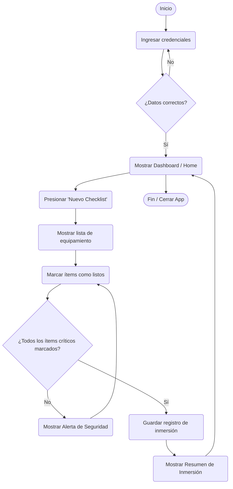

# 🌊 AquaCheck Buceo

**AquaCheck** es una aplicación móvil diseñada para garantizar la seguridad de los buceadores. Permite llevar un control estricto del equipamiento antes de cada inmersión mediante un checklist validado, evitando olvidos críticos y guardando un registro (bitácora) de las inmersiones seguras.

---

## 🎨 Identidad Visual

Nuestra interfaz está pensada para ser utilizada en exteriores (alta luminosidad) manteniendo un alto contraste y accesibilidad.

*   **Logotipo:** Ubicado en `docs/diseno/logo.png`. Representa la seguridad (check) fusionada con una gota/ola de mar.
*   **Paleta de Colores:**
    *   **Principal:** `#005B96` (Azul Profundo)
    *   **Secundario:** `#03A9F4` (Celeste Agua)
    *   **Fondo:** `#F5F5F5` (Gris claro)
    *   **Texto:** `#212121` (Gris oscuro)
    *   **Alerta:** `#D32F2F` (Rojo)

---

## 🔀 Flujo de Usuario (UML)

